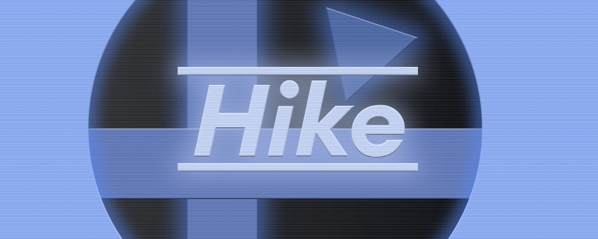

 

  </img>

  <h3 align="center">Hike</h3>
  

  

    Programming language
     
    <a href="https://github.com/AdiSalimgereev/Hidge/blob/main/DeraScript/README.md"><strong>Explore the docs »</strong></a>
     
     
    <a href="https://github.com/AdiSalimgereev/Hidge/issues">Report Bug</a>
    ·
    <a href="https://github.com/AdiSalimgereev/Hidge/issues">Request Feature</a>
  

<!-- CONTACT -->
## Contact

Project Link: [https://github.com/AdiSalimgereev/Hidge](https://github.com/AdiSalimgereev/Hidge)

<a href="#top">back to top 👆🏻</a>

